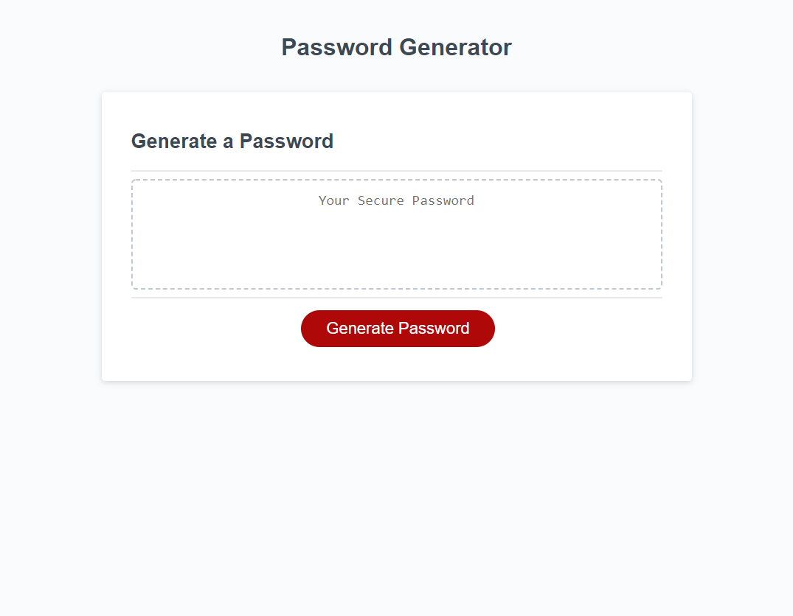

# James Porter - Password Generator

## Description

A brief front and back web application designed to create secure passwords for its users. 

- To help users create secure passwords in the era of a million passwords.
- I built this project to practice my Javascript skills. 

## Usage

First, click the following link: https://jamesjporter.github.io/James-Password-Generator/

Once you have arrived at the app, click the red "Generate Password" button. 

Then, select your password criteria from the presented prompts. Your password will then be generated. 

Link to live repo: https://github.com/JamesJPorter/James-Password-Generator

    

## Credits

Primary engineer: James Porter
With assistance from: Sofia Tejada, Sandrine Poissonnet and Erik Chan, Meredith McCollum
